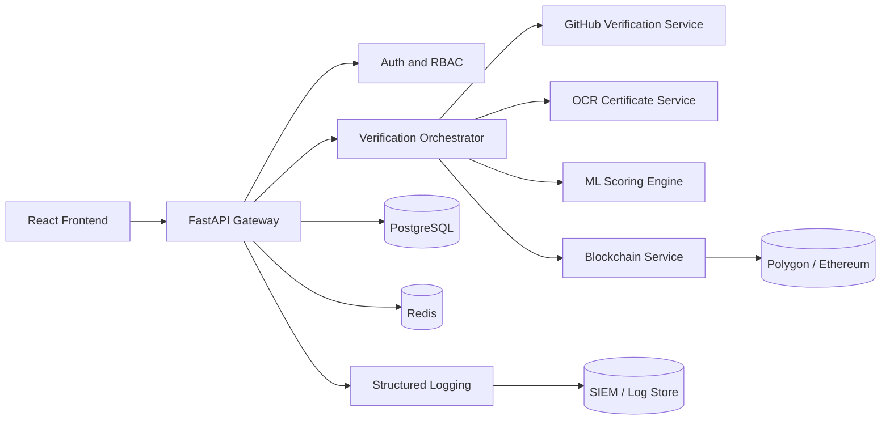

# Enterprise Architecture Addendum

## Security Layers
- JWT access and refresh token model.
- Role-aware authorization for Admin, Recruiter, Candidate, Analyst, Auditor.
- CSRF checks for cookie-bound session flows.
- Security headers middleware and strict CORS host policy.
- AES-backed encryption manager for sensitive at-rest payloads.

## Reliability Layers
- Direct verification fallback path when Celery is unavailable.
- API-wide standardized error contract.
- Rate limiting across verification endpoints.
- Locust profile for realistic load simulation.

## Blockchain Data Contract
- Resume/claim data reduced to deterministic SHA256 hashes.
- Hash persisted as on-chain transaction data.
- Verification endpoint compares expected hash with on-chain transaction input.
